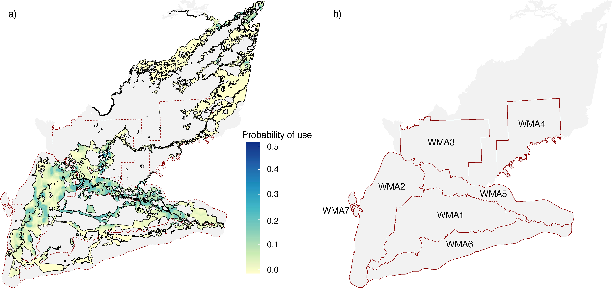
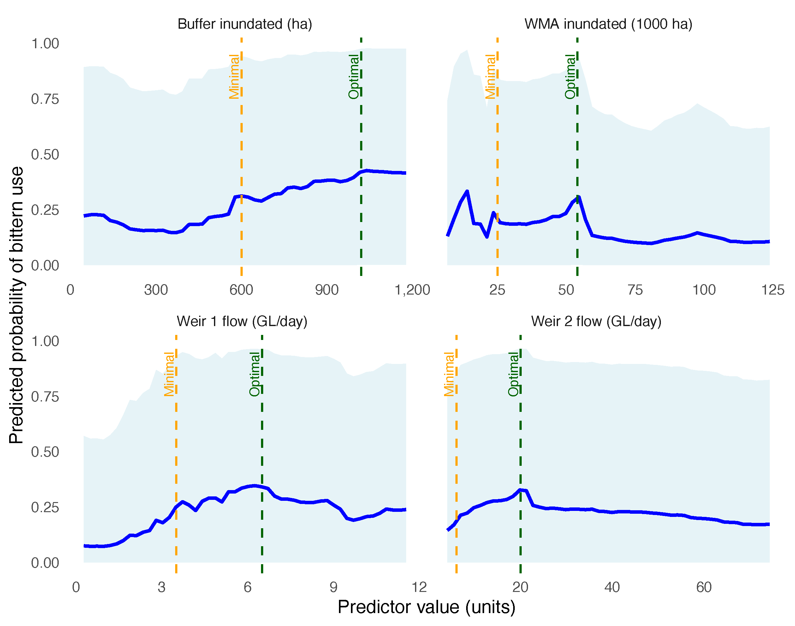
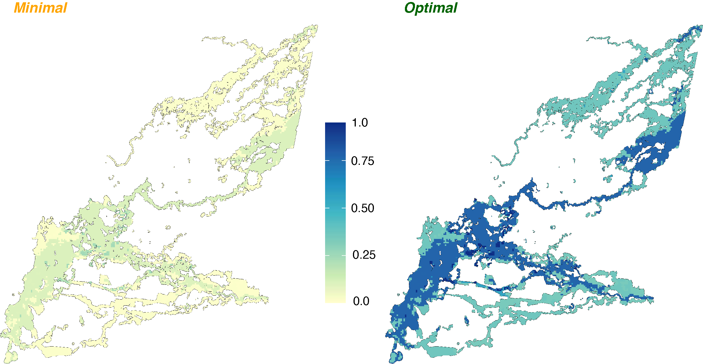

# Bittern BART Modelling

This repository contains R code and example outputs from a spatio-temporal modelling analysis of Australasian bittern (_Botaurus poiciloptilus_) habitat suitability in the southern Murray–Darling Basin, Australia. The models were developed to support evidence-based planning of environmental water delivery to drought-sensitive wetlands.

## Project Summary

We used **Bayesian Additive Regression Trees (BART)** to model bittern detection data collected via autonomous acoustic recorders across managed wetlands. The models incorporate spatial and temporal hydrological variables (flow and inundation), vegetation structure, and spatial covariates to predict bittern use under current and hypothetical watering regimes. The project was conducted with the Government of New South Wales (Australia) under the NSW Saving our Species (SoS) program.

---

## Repository Structure
```
bittern-bart-modelling/
├── scripts/
│   ├── 01_BART_model_FINAL.R            # Data prep, scaling, and BART model fitting
│   └── 02_prediction_mapping.R          # Spatial prediction, PDPs, and scenario mapping
├── figures/
│   ├── bittern_prediction_and_WMAs.png  # Predicted habitat suitability map (fixed values)
│   ├── bittern_predictionMap_scenarios.png  # Predicted use under minimal/optimal flow scenarios
│   └── PDPthresholds.png                # Partial dependence plots with scenario thresholds
├── README.md
```
---

## Key Outputs

### Spatial Habitat Suitability Map



*Predicted bittern habitat suitability based on uniform hydrological inputs across the landscape.*

**Inputs used for prediction:**
- Buffer inundation: 500 ha  
- WMA inundation: 10,000 ha  
- Weir 1 flow: 4,000 ML/day  
- Weir 2 flow: 3,000 ML/day  

These values were applied consistently across the prediction grid to visualise baseline suitability.

---

### Threshold PDPs with Scenario Targets



*Partial dependence plots showing the effect of key hydrological predictors on predicted bittern use.*  
Dashed vertical lines indicate **Minimal** (orange) and **Optimal** (green) watering targets for scenario planning.

---

### Scenario-Based Prediction Maps



*Predicted bittern habitat suitability under two watering scenarios:*

- **Minimal**:  
  - Buffer inundation = 600 ha  
  - WMA inundation = 25,000 ha  
  - Weir 1 flow = 3,500 ML/day  
  - Weir 2 flow = 6,000 ML/day  

- **Optimal**:  
  - Buffer inundation = 1,020 ha  
  - WMA inundation = 54,000 ha  
  - Weir 1 flow = 6,500 ML/day  
  - Weir 2 flow = 20,000 ML/day  

These values were uniformly applied across the prediction grid to compare expected bittern use under different environmental watering conditions.


---

## Requirements

- R version ≥ 4.2
- Packages used: `sf`, `terra`, `dplyr`, `dbarts`, `ggplot2`, `purrr`, `tidyr`, `DHARMa`, `corrplot`
- Input data not included due to access restrictions

---

## Author

This code was developed by **Gavin Bonsen**.

---

## Contact

Any questions, please contact: `gbonsen@outlook.com.au`
